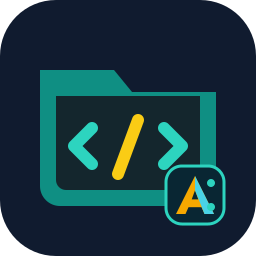

# ATLAS File Studio Plugin

**Languages:** [Deutsch](README.de.md) · [English](README.md) · [Français](README.fr.md)

ATLAS File Studio is the second independent ATLAS plugin line. It prepares a scoped Home Assistant file editor with file tree, editor surface, syntax highlighting, YAML validation, upload/download flows and direct deep links to files.

The language selector offers German, English and French. French currently covers the header, key toolbar controls and upload notices; file dialogs and workflow messages are not fully localized yet.

## Plugin

  <strong>ATLAS File Studio</strong> 
  Plugin ID: <code>atlas.plugin.file-studio</code> 
  Version: <code>0.1.49</code>

## Install in ATLAS

Use the install page:

`https://rockbaer2007.github.io/atlas-file-studio-plugin/install.html`

Or add the repository JSON directly in ATLAS Administration:

`https://raw.githubusercontent.com/rockbaer2007/atlas-file-studio-plugin/main/repository.json`

## Security Model

- default root: `/config`
- add-on directory: `/addons`, only after Administration approval
- free root access: disabled by default
- package version: `0.1.49`
- toolbar symbols use local SVG files; binary plugin assets are Base64-encoded in install packages.

This repository is for ATLAS plugin testing and later File Studio development. It is not a Home Assistant add-on repository.

## Access indicator

File Studio shows active filesystem permissions in a compact, regular-weight notice. Each approved path has a distinct color, making paths such as `/config/www`, `/addons` and `/parent-of-config` easier to scan. See [the German README](README.de.md) or [the French README](README.fr.md).
